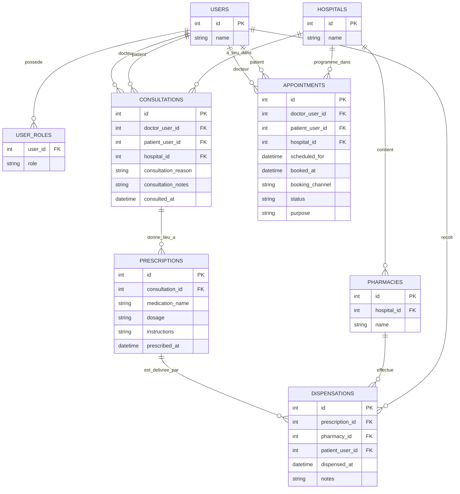

# MCD MERISE - Schema de la base SQLite

Ce document decrit le modele conceptuel de donnees (MCD) correspondant a la base SQLite actuelle du projet.

## Diagramme Mermaid

## Lecture metier

- Un utilisateur peut avoir un ou plusieurs roles.
- Un hopital contient une ou plusieurs pharmacies.
- Une consultation relie un docteur, un patient et un hopital.
- Une consultation peut produire une ou plusieurs prescriptions.
- Une prescription peut donner lieu a une delivrance en pharmacie.
- Un rendez-vous relie un docteur, un patient et un hopital.

## Entites principales

- `USERS` : personnes enregistrees dans le systeme.
- `USER_ROLES` : roles portes par les utilisateurs, par exemple docteur ou patient.
- `HOSPITALS` : etablissements de sante.
- `PHARMACIES` : pharmacies rattachees a un hopital.
- `CONSULTATIONS` : consultations medicales realisees a l'hopital.
- `PRESCRIPTIONS` : ordonnances emises lors d'une consultation.
- `DISPENSATIONS` : retraits effectifs des medicaments en pharmacie.
- `APPOINTMENTS` : rendez-vous programmes pour un suivi.
